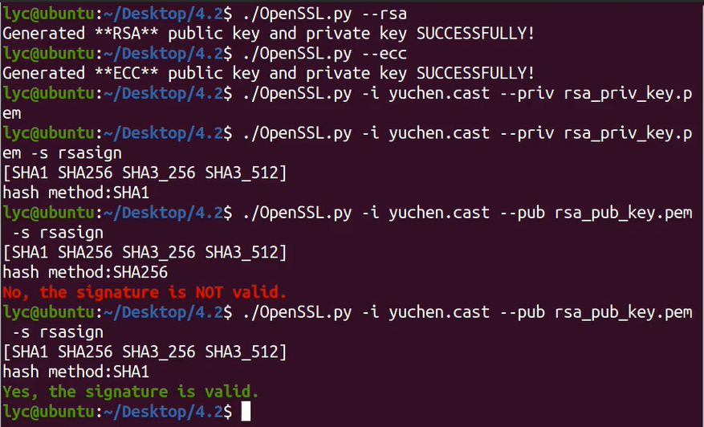
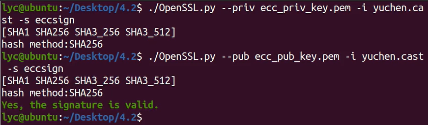
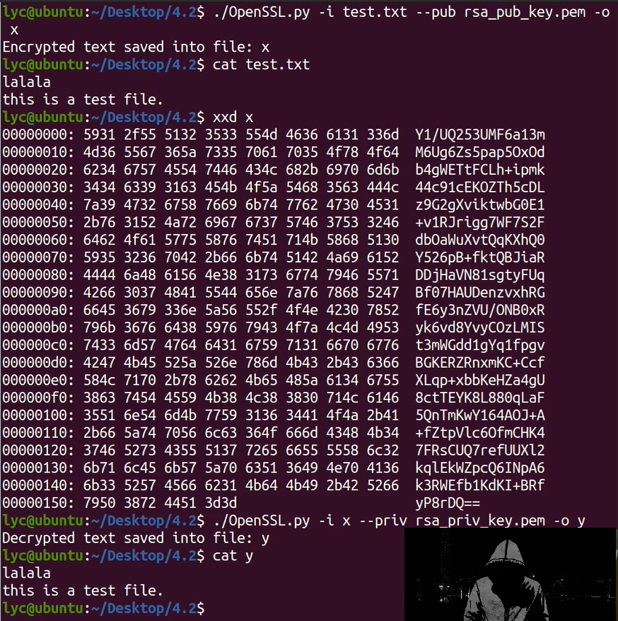

# openssl-tool

This is a tool I've made to practice python and Cryptography.

### Functions:

1 generate rsa,ecc keys

2 sign a file with rsa/ecc private key, and different hash methods

3 verify a signature using rsa/ecc public key

4 encrypt with rsa public key

5 decrypt with rsa private key

### Features:

1 less parameters which means easy to use (-i -o -s --priv --pub)

2 easy to extend (sign_vrfy enc_dec)

3 pycryptodome

### Examples:

use **rsa** to sign and verify file

use **ecc** to sign and verify file

use **rsa** to encrypt and decrypt file

